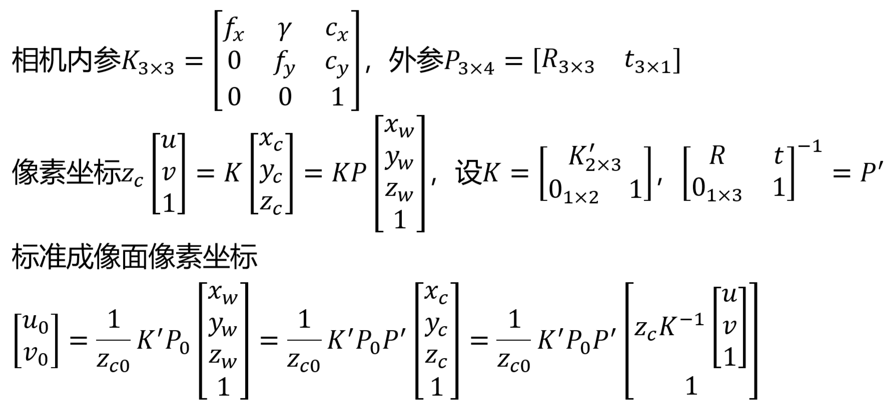

# MPI-toy
## 环境
* Python 3.9.7
* pytorch 1.9.1
* torchvision 0.10.0
* cudatoolkit 11.1
## 运行
```
unzip data.zip
python toy.py [--gpu 0] [--batch 7] [--epoch 50]
```
未调参，有时不收敛。输出存于 result 目录。
## MPI
以大致垂直于 z 轴的成像面为标准成像面，取 Blender 脚本输出。外参存于 extrinsics.npy。

考虑到 3 个字母颜色相同，仅保留 α 信息，形成的 MPI 为 3×108×192 的二值数组，保存于 mpi.pt。
## 坐标变换

对每个新视角生成 2×108×192 的坐标数组。
## 渲染网络
5 个残差模块级联，输入 MPI+视角（5×108×192），输出图像（3×108×192），中间层均为 64 通道。
